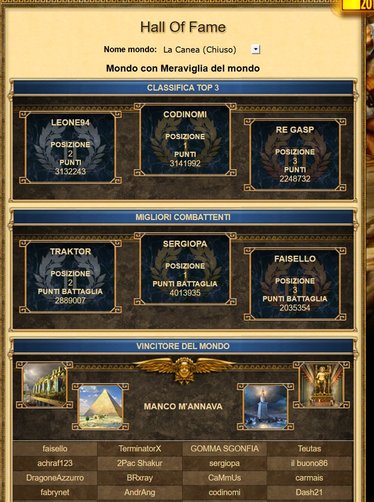

I am honing my skills to become the financial and data engineer I want to be. I come from Italy and I love to travel the world. My background is finance and portfolio management (MSc, University of Rome Tor Vergata), and my day to day is making financial data flow without human glue: SQL pipelines, Python tooling, Power BI, and lately agentic AI systems that I keep on a short leash.

## How I work

```{=html}
<div class="principles">
  <div class="p-card"><div class="glyph">01</div><h4>Map priorities, build for the team</h4><p>Every tool starts as something done by hand. I map what matters first, then build around how the team actually works, not how I would prefer it to work.</p></div>
  <div class="p-card"><div class="glyph">02</div><h4>The interface should help the user</h4><p>A tool is only as good as its adoption. The interface has to carry the user through the task, so the right action is the easy one and mistakes are hard to make.</p></div>
  <div class="p-card"><div class="glyph">03</div><h4>Document or it does not exist</h4><p>A tool nobody else can run is a liability. Everything I build ships with rendered documentation and a guide, so it survives me being away.</p></div>
</div>
```

## Toolbox

```{=html}
<div class="chips">
  <span>Python</span><span>SQL</span><span>Power BI · DAX</span><span>SAP Datasphere</span><span>Databricks</span><span>Power Query</span><span>VBA</span><span>Quarto</span><span>LaTeX</span><span>Matlab</span><span>Stata</span><span>R</span><span>Azure</span><span>Agentic AI · MCP</span>
</div>
```

## The path so far

```{=html}
<div class="timeline">
  <div class="t-item"><div class="when">2025 → now</div><div class="what">Financial management &amp; budgetary reporting</div><div class="where">European Union agency, Amsterdam</div></div>
  <div class="t-item"><div class="when">2025</div><div class="what">Financial analyst &amp; business advisor</div><div class="where">Advisory firm, Palermo · Milan</div></div>
  <div class="t-item"><div class="when">2024</div><div class="what">Investment banking analyst</div><div class="where">Baird, New York City</div></div>
  <div class="t-item"><div class="when">2022 → 2023</div><div class="what">Financial &amp; data analyst</div><div class="where">ING, Milan</div></div>
  <div class="t-item"><div class="when">2024</div><div class="what">MSc Finance and Banking</div><div class="where">Tor Vergata, Rome · ARPM Quant, New York</div></div>
</div>
```

## Off the clock

```{=html}
<div class="gallery">
  <figure class="g-item">
    
    <figcaption>First builder in the Grepolis Hall of Fame, and I play the niche game BTD2 at a level that once earned a World Champion title. I took part in the World Masters Tournament across players from countries all over the world.</figcaption>
  </figure>
  <figure class="g-item">
    
    <figcaption>Long evening runs, crime novels, museums and fairs. I like the kind of hobby that gets me out of the house and into a conversation.</figcaption>
  </figure>
  <figure class="g-item card-quote">
    <blockquote>I like sharing what I learn and meeting new people. Most of what I am good at came from being in the room with people better than me.</blockquote>
  </figure>
</div>
```

## Elsewhere

```{=html}
<div class="socials">
  <a href="https://www.linkedin.com/in/riccardo-cammarata-00s" target="_blank" rel="noopener"><i class="bi bi-linkedin"></i>LinkedIn</a>
  <a href="https://github.com/Ris8-it" target="_blank" rel="noopener"><i class="bi bi-github"></i>GitHub</a>
  <button id="emailBtn" class="social-btn" type="button"><i class="bi bi-envelope-fill"></i>Email</button>
</div>

<div id="emailModal" class="email-modal" hidden>
  <div class="email-card">
    <button class="email-close" aria-label="Close">&times;</button>
    <p class="email-label">Reach me at</p>
    <p class="email-addr" id="emailAddr">riccardocammarata00@gmail.com</p>
    <button class="email-copy" id="emailCopy">Copy to clipboard</button>
    <span class="email-copied" id="emailCopied">Copied</span>
  </div>
</div>
```
