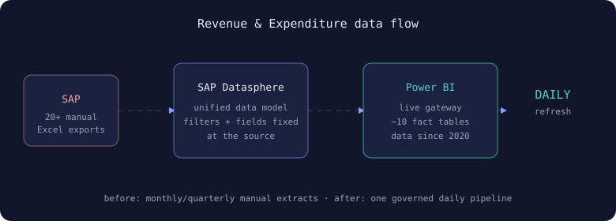
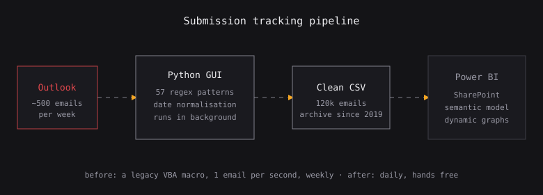

```{=html}
<section class="hero">
  <div class="hero-grid">
    <div class="hero-text">
      <p class="eyebrow stagger s1">Finance &amp; portfolio management · Data analysis · Coding</p>
      <h1 class="stagger s2">I build <span class="accent">dependable tools</span> out of messy financial data.</h1>
      <p class="lede stagger s3">Hello, I am Riccardo, a financial and data engineer. I come from Italy and I love to travel the world. I build financial models and rebuild manual workflows into Python and SQL pipelines that hold up under pressure, and I am always pushing to write better code than I did the month before (with a little touch of AI behind!).</p>
      <div class="kpis stagger s4">
        <div class="kpi"><div class="num" data-to="40" data-suf="+">0</div><div class="lbl">hours saved weekly,<br>across many teams</div></div>
        <div class="kpi"><div class="num" data-to="300" data-suf="+">0</div><div class="lbl">data inconsistencies<br>resolved</div></div>
        <div class="kpi"><div class="num" data-to="10" data-suf="">0</div><div class="lbl">pipelines and tools<br>in production</div></div>
        <div class="kpi kpi-accent"><span class="burst"><i class="pstar"></i><i class="pstar"></i><i class="pstar"></i><i class="pstar"></i></span><div class="num" data-to="110" data-suf="%">0</div><div class="lbl">effort on<br>every build</div></div>
      </div>
      <div class="cta-row stagger s5">
        <a class="cta" href="projects/index.html">See the case studies</a>
        <a class="cta-ghost" href="about.html">How I work →</a>
      </div>
    </div>
    <div class="hero-visual stagger s3">
      <div class="photo-frame">
        
        <span class="glare"></span>
        <span class="star s-a"></span><span class="star s-b"></span><span class="star s-c"></span><span class="star s-d"></span>
      </div>
    </div>
  </div>
</section>

<div class="marquee" aria-hidden="true">
  <div class="track">
    <a href="projects/sap-dashboard.html"><span class="idx">01</span>Revenue &amp; Expenditure Pipeline</a>
    <a href="projects/email-pipeline.html"><span class="idx">02</span>Email Pipeline &amp; Submission Dashboard</a>
    <a href="projects/invoice-checker.html"><span class="idx">03</span>Invoice Reconciliation &amp; Dashboard</a>
    <a href="projects/docs-system.html"><span class="idx">04</span>Living Documentation System</a>
  </div>
</div>

<h2 class="sec reveal-up"><span class="k">/*</span>The work I am proudest of</h2>
<section class="tiles">

  <div class="tile reveal-up">
    <div class="tile-inner">
      <div class="tile-face front">
        
        <span class="badge-status live">Live</span>
        <h3>Revenue &amp; Expenditure Pipeline</h3>
        <p>More than 20 reports that used to come out of SAP by hand, now one pipeline that refreshes every day.</p>
        <div><span class="tag">SAP Datasphere</span><span class="tag">SQL</span><span class="tag">Power BI</span></div>
        <span class="flip-hint">flip &#8635;</span>
      </div>
      <div class="tile-face back">
        <p><mark>~40 collective hours</mark> saved per week. <mark>300+ inconsistencies</mark> resolved. Monthly refresh became daily, for every team.</p>
        <a class="tile-link" href="projects/sap-dashboard.html">Read the case study</a>
      </div>
    </div>
  </div>

  <div class="tile reveal-up">
    <div class="tile-inner">
      <div class="tile-face front">
        
        <span class="badge-status live">Live</span>
        <h3>Email Pipeline &amp; Submission Dashboard</h3>
        <p>An old VBA macro from 2014, now a Python tool that reads 500 submissions a week.</p>
        <div><span class="tag">Python</span><span class="tag">Regex</span><span class="tag">Power BI</span></div>
        <span class="flip-hint">flip &#8635;</span>
      </div>
      <div class="tile-face back">
        <p><mark>57 regex patterns</mark>, a clean <mark>120k email archive</mark> since 2019, a live dashboard. Around 5 hours saved weekly, errors gone.</p>
        <a class="tile-link" href="projects/email-pipeline.html">Read the case study</a>
      </div>
    </div>
  </div>

  <div class="tile reveal-up">
    <div class="tile-inner">
      <div class="tile-face front">
        
        <span class="badge-status live">Analysis</span>
        <h3>Crypto Regulation: EU vs US</h3>
        <p>A panel study of the top five cryptoassets, built around a binomial regulation indicator.</p>
        <div><span class="tag">Econometrics</span><span class="tag">Eikon</span><span class="tag">Panel</span></div>
        <span class="flip-hint">flip &#8635;</span>
      </div>
      <div class="tile-face back">
        <p>A real <mark>EU effect</mark>, a muted <mark>US one</mark>. A Fama and French model with a regulation dummy, on data from 2020 to 2025.</p>
        <a class="tile-link" href="projects/crypto-regulation.html">Read the case study</a>
      </div>
    </div>
  </div>

</section>

<div class="all-projects-cta reveal-up">
  <a class="cta-ghost" href="projects/index.html">See all projects →</a>
</div>
```
