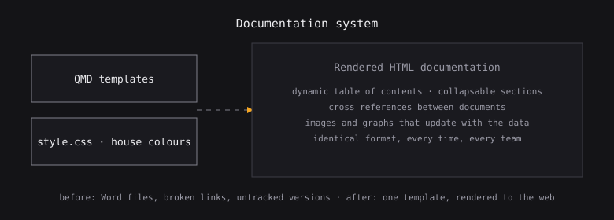

```{=html}
<section class="hero">
  <div class="hero-grid">
    <div>
      <div class="hero-title in d1" role="heading" aria-level="1">I <span class="word" id="word" tabindex="0" role="button"
          aria-label="work with messy financial reports, which becomes build tidy financial reports"
        ><span class="m" id="messy">work with messy</span><span class="t">build tidy</span></span>
        financial reports.
        <span class="hgl" aria-hidden="true">
          <svg viewBox="0 0 120 46" xmlns="http://www.w3.org/2000/svg">
            <defs><clipPath id="lensclip">
              <rect x="6" y="12" width="40" height="26" rx="7"/>
              <rect x="74" y="12" width="40" height="26" rx="7"/>
            </clipPath></defs>
            <rect class="lens" x="6" y="12" width="40" height="26" rx="7"/>
            <rect class="lens" x="74" y="12" width="40" height="26" rx="7"/>
            <path class="bridge" d="M46 22 Q60 16 74 22"/>
            <path class="arm" d="M6 20 L0 15"/>
            <path class="arm" d="M114 20 L120 15"/>
            <g clip-path="url(#lensclip)">
              <rect class="gloss" x="-2" y="-6" width="14" height="60" transform="rotate(38 6 24)"/>
              <rect class="gloss" x="66" y="-6" width="14" height="60" transform="rotate(38 74 24)"/>
            </g>
            <g class="tip"><path d="M112 8 l2.6 5.4 5.4 2.6 -5.4 2.6 -2.6 5.4 -2.6 -5.4 -5.4 -2.6 5.4 -2.6 z" fill="#fff"/></g>
          </svg>
        </span>
        <span class="andmore in d2">…but <b>that is not all I do</b>.</span>
      </div>

      <p class="sub in d3">Every day I'm trying to be a better financial engineer. Mostly that means
        finding the report someone still builds by hand every Monday, and making it stop needing them.</p>

      <p class="sub in d4">So far it's been mostly good problems, and fixing bugs that I
        <em>totally</em> did not write.
        <span class="quiet">git blame, unhelpfully, disagrees.</span></p>

      <div class="pills in d4">
        <span class="here" id="here" tabindex="0" role="button"
              aria-label="Currently living in Amsterdam. Activate to see where else I have been.">
          <b><i></i><span class="lab">Currently living in:</span>
          <span class="city" id="city">Amsterdam</span></b></span>
      </div>

      <div class="deck-area in d5">
        <div class="deck" id="deck" tabindex="0" role="button" aria-label="Skill cards, click to go through them">
          <div class="dk" data-i="0" style="--i:0"><span class="pip">1/5</span>
            <div class="top"><span class="sq" style="background:var(--blue)"></span><span class="n">Python</span></div>
            <p class="d">pandas, the parsers, and the deeply boring glue between them</p></div>
          <div class="dk" data-i="1" style="--i:1"><span class="pip">2/5</span>
            <div class="top"><span class="sq" style="background:var(--violet)"></span><span class="n">SQL</span></div>
            <p class="d">models, star schemas, and a few joins I would write differently now</p></div>
          <div class="dk" data-i="2" style="--i:2"><span class="pip">3/5</span>
            <div class="top"><span class="sq" style="background:var(--amber)"></span><span class="n">Power BI</span></div>
            <p class="d">DAX, and then explaining DAX to people who did not ask</p></div>
          <div class="dk" data-i="3" style="--i:3"><span class="pip">4/5</span>
            <div class="top"><span class="sq" style="background:var(--mint)"></span><span class="n">SAP Datasphere</span></div>
            <p class="d">where the data actually lives, for better or worse</p></div>
          <div class="dk finale" data-i="4" style="--i:4">
            <div class="face"><div class="inner">
              <span class="pip">5/5</span>
              <div class="top"><span class="n">Attention to detail</span></div>
              <p class="d">I try my best to create things that are useful and professional.</p>
            </div></div>
          </div>
        </div>
        <div class="deck-foot">
          <span><b>check my skill cards!</b></span>
          <div class="deck-dots" id="dots"><i class="on"></i><i></i><i></i><i></i><i class="fin"></i></div>
        </div>
      </div>
    </div>

    <div class="shotwrap">
      <div class="photo-frame">
        
        <span class="glare"></span>
      </div>
      <span class="star s-a"></span><span class="star s-b"></span><span class="star s-c"></span>
      <span class="star s-d"></span><span class="star s-e"></span>
    </div>
  </div>

  <div class="effort-wrap" id="bigeffort" tabindex="0" role="button"
       aria-label="Effort. Hover or press Enter to run the numbers.">
    <div class="stat-col">
      <div class="stat eye" id="statEye">
        <div class="row"><span class="v">—</span><span class="k">eye for details</span></div>
        <div class="track"><span class="fill"></span></div>
      </div>
      <div class="stat know" id="statKnow">
        <div class="row"><span class="v">—</span><span class="k">knowledge and skill</span></div>
        <div class="track"><span class="fill"></span></div>
      </div>
    </div>

    <div class="chain-lane" aria-hidden="true">
      <span class="chain"><svg viewBox="0 0 64 26" xmlns="http://www.w3.org/2000/svg">
        <ellipse class="lk" cx="7"  cy="13" rx="7"   ry="4.6"/>
        <ellipse class="lk" cx="18" cy="13" rx="4.6" ry="7"/>
        <ellipse class="lk" cx="29" cy="13" rx="7"   ry="4.6"/>
        <ellipse class="lk" cx="40" cy="13" rx="4.6" ry="7"/>
        <ellipse class="lk" cx="51" cy="13" rx="7"   ry="4.6"/>
        <circle class="chg" cx="0" cy="13" r="2.6"/>
      </svg></span>
      <span class="chain"><svg viewBox="0 0 64 26" xmlns="http://www.w3.org/2000/svg">
        <ellipse class="lk" cx="7"  cy="13" rx="7"   ry="4.6"/>
        <ellipse class="lk" cx="18" cy="13" rx="4.6" ry="7"/>
        <ellipse class="lk" cx="29" cy="13" rx="7"   ry="4.6"/>
        <ellipse class="lk" cx="40" cy="13" rx="4.6" ry="7"/>
        <ellipse class="lk" cx="51" cy="13" rx="7"   ry="4.6"/>
        <circle class="chg" cx="0" cy="13" r="2.6"/>
      </svg></span>
    </div>

    <div class="bigeffort" id="bigcard">
      <svg class="frame" id="effortFrame" aria-hidden="true">
        <path class="rail rl" pathLength="100"/><path class="rail rr" pathLength="100"/>
        <path class="run  rl" pathLength="100"/><path class="run  rr" pathLength="100"/>
        <path class="glide rl" pathLength="100"/><path class="glide rr" pathLength="100"/>
        <path class="notch" pathLength="100"/>
      </svg>
      <div class="pc"><span class="n">0</span><sup>%</sup></div>
      <p class="cap">EFFORT, on all builds, always</p>
      <p class="joke" id="effortJoke">yes, the maths is wrong.</p>
      <span class="foot" tabindex="0">* rounding<span class="why">rounded generously, in my own favour</span></span>
      <span class="arm-hint" aria-hidden="true"><span class="ring"></span>hover to run the numbers</span>
    </div>
  </div>
</section>

<section id="work">
  <div class="sec-h"><h2>What I've been working on</h2><span>grab the handle</span><span class="rule"></span></div>

  <div class="compare">
    <div class="cmp" role="slider" tabindex="0" aria-label="Before and after: revenue reporting"
         aria-valuemin="0" aria-valuemax="100" aria-valuenow="42">
      
      
      <span class="tint" aria-hidden="true"></span>
      <span class="veil b"></span><span class="veil a"></span>
      <span class="lab b">before</span><span class="lab a">after</span>
      <span class="seam"></span><span class="grip">⇄</span>
    </div>
    <div class="cap">
      <h3>Revenue &amp; expenditure reporting</h3>
      <p>There were twenty-odd of these. Each one got pulled out of SAP by hand and then filtered inside
        somebody's own workbook, so Finance had one number and Procurement had a different one, and you'd
        usually find that out halfway through a meeting. It's one governed model now. It refreshes
        overnight and nobody exports anything.</p>
      <a class="chip" href="projects/sap-dashboard.html">20 reports → 1 model. Read it →</a>
    </div>
  </div>

  <div class="grid">
    <a class="card" href="projects/email-pipeline.html">
      <div class="shot">
        <span class="lay b"></span>
        <span class="lay a"></span>
        <span class="edge"></span><span class="tag"></span>
      </div>
      <div class="body"><h3>Submission inbox</h3>
        <p>A macro somebody wrote in 2014 and then left. It handled 500 submissions a week, mostly.
          Every so often one just didn't arrive and we would find out a month later.</p>
        <span class="chip">2014 macro → something readable</span></div>
    </a>
    <a class="card" href="projects/invoice-checker.html">
      <div class="shot">
        <span class="lay b"></span>
        <span class="lay a"></span>
        <span class="edge"></span><span class="tag"></span>
      </div>
      <div class="body"><h3>Invoice reconciliation</h3>
        <p>Five extracts that someone sat and matched by eye once a month. It took most of a day and
          still missed things, which is what happens when you ask a person to be a computer.</p>
        <span class="chip">5 extracts → 1 click</span></div>
    </a>
    <a class="card" href="projects/docs-system.html">
      <div class="shot">
        <span class="lay b"></span>
        <span class="lay a"></span>
        <span class="edge"></span><span class="tag"></span>
      </div>
      <div class="body"><h3>Documentation that stays true</h3>
        <p>Word files with broken links and nobody's name on them. If a thing only runs while I am
          around, I have not built a solution, I have built a hostage situation.</p>
        <span class="chip">stale docs → rendered from source</span></div>
    </a>
    <a class="card" href="projects/crypto-regulation.html">
      <div class="shot">
        <span class="lay b"></span>
        <span class="lay a"></span>
        <span class="edge"></span><span class="tag"></span>
      </div>
      <div class="body"><h3>Did crypto regulation move the market?</h3>
        <p>A Fama and French model with a regulation dummy, run across the top five cryptoassets.
          The EU answer and the US answer turned out to be very different.</p>
        <span class="chip">my thesis, in one chart</span></div>
    </a>
    <a class="card" href="projects/cinema-model.html">
      <div class="shot">
        <span class="lay b"></span>
        <span class="lay a"></span>
        <span class="edge"></span><span class="tag"></span>
      </div>
      <div class="body"><h3>From scanned paper to a valuation</h3>
        <p>Somebody handed me a stack of scanned statements and asked what the business was worth.
          I built the whole model from the paper up.</p>
        <span class="chip">paper → a case for funding</span></div>
    </a>
    <a class="card" href="projects/index.html">
      <div class="shot">
        <span class="lay b"></span>
        <span class="lay a"></span>
        <span class="edge"></span><span class="tag"></span>
      </div>
      <div class="body"><h3>Everything else</h3>
        <p>The full list, including the thing that is still half built and not ready to be looked at.</p>
        <span class="chip">all projects →</span></div>
    </a>
  </div>
</section>

<section class="deep" id="contact">
  <div class="closing">
    <div class="closing-main">
      <span class="ck">one last thing</span>
      <h2>There is a person attached to all this</h2>
      <p>He runs in the evenings, reads crime novels, and holds a competitive record he will
        absolutely bring up unprompted.</p>
      <div class="contact">
        <a class="c mail" href="mailto:riccardocammarata00@gmail.com">
          <svg viewBox="0 0 24 24" fill="none" stroke="currentColor" stroke-width="1.8"><rect x="2" y="4" width="20" height="16" rx="2"/><path d="m2 7 10 6 10-6"/></svg>
          Email<span class="reveal">riccardocammarata00@gmail.com</span></a>
        <a class="c li" href="https://www.linkedin.com/in/riccardo-cammarata-00s" target="_blank" rel="noopener">
          <svg viewBox="0 0 24 24" fill="currentColor"><path d="M4.98 3.5a2.5 2.5 0 1 1 0 5 2.5 2.5 0 0 1 0-5zM3 9h4v12H3zM9 9h3.8v1.7h.05c.53-1 1.83-2.05 3.77-2.05 4.03 0 4.78 2.65 4.78 6.1V21h-4v-5.4c0-1.3 0-2.95-1.8-2.95s-2.08 1.4-2.08 2.85V21H9z"/></svg>
          LinkedIn<span class="reveal">in/riccardo-cammarata-00s</span></a>
        <a class="c gh" href="https://github.com/Ris8-it" target="_blank" rel="noopener">
          <svg viewBox="0 0 24 24" fill="currentColor"><path d="M12 2a10 10 0 0 0-3.16 19.49c.5.09.68-.22.68-.48v-1.7c-2.78.6-3.37-1.34-3.37-1.34-.45-1.16-1.11-1.47-1.11-1.47-.91-.62.07-.61.07-.61 1 .07 1.53 1.03 1.53 1.03.9 1.53 2.34 1.09 2.91.83.09-.65.35-1.09.63-1.34-2.22-.25-4.56-1.11-4.56-4.94 0-1.09.39-1.98 1.03-2.68-.1-.25-.45-1.27.1-2.65 0 0 .84-.27 2.75 1.02a9.5 9.5 0 0 1 5 0c1.91-1.29 2.75-1.02 2.75-1.02.55 1.38.2 2.4.1 2.65.64.7 1.03 1.59 1.03 2.68 0 3.84-2.34 4.69-4.57 4.94.36.31.68.92.68 1.85v2.74c0 .27.18.58.69.48A10 10 0 0 0 12 2z"/></svg>
          GitHub<span class="reveal">github.com/Ris8-it</span></a>
      </div>
    </div>

    <a class="peek" href="about.html">
      <span class="h">Find out more<i class="arw">→</i></span>
      <span class="bar"></span>
    </a>
  </div>
</section>
```
