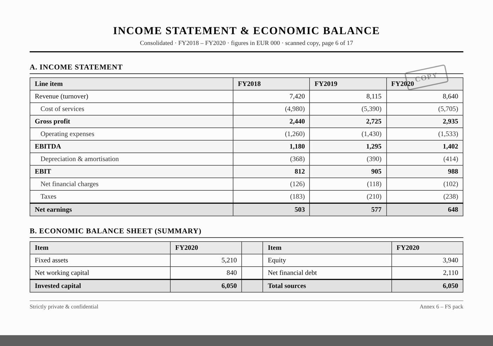
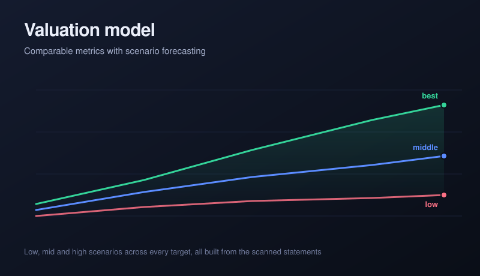
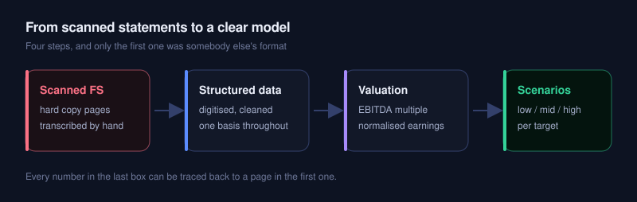
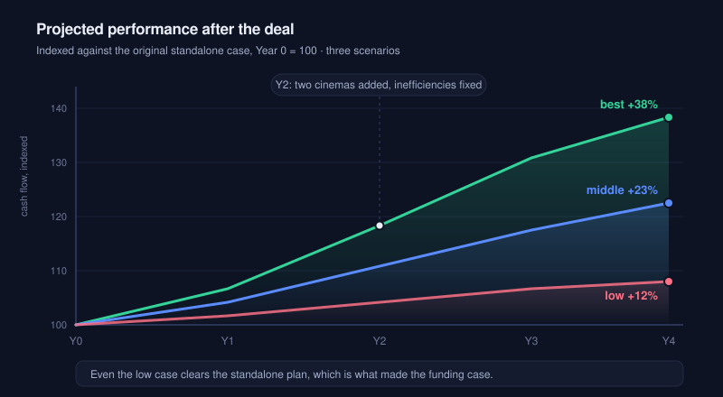

```{=html}
<span class="status-line live"><span class="dot"></span>Advisory engagement</span>
```

## The problem

I advised a small operator in the cinema business that wanted to grow. The numbers behind the decision came as hard copy: scanned financial statements, black and white report pages of turnover, EBITDA, EBIT and earnings, often transcribed by hand. The figures existed, but they were slow to work with and impossible to interrogate. Before anyone could talk about growth, the business needed a financial analysis it could actually trust.

```{=html}
<div class="ba-pair">
  <figure class="before"><span class="ba-tag">Before</span><figcaption>Before · the income statement and balance sheet as scanned report pages</figcaption></figure>
  <figure class="after"><span class="ba-tag">After</span><figcaption>After · one structured model, from clean statements to clear forecasts</figcaption></figure>
</div>
```

## From scanned statements to a clear model

```{=html}
<div class="featured-new">
  <div class="fn-label"><span class="spark">&#9733;</span>The rebuild</div>
  <h3>A financial analysis built from the ground up</h3>
  <p>I digitised the statements into one structured dataset and rebuilt the full picture: the income statement cascading from revenue down to net earnings, and an economic balance sheet tying invested capital to its sources. With every year on the same basis, I could read profitability, working capital and debt capacity cleanly, which is what turned a stack of scanned pages into a model the owner and the banks could both follow.</p>
</div>
```

```{=html}

```

## The valuation work

On the clean base I ran a discounted cash flow alongside a comparables view. The combination did two things. It put a defensible value on the business rather than a single guessed number, and it showed where the value could actually come from. Modelling the operator as a connected set, where two more sites are brought in and the obvious inefficiencies are fixed, the analysis pointed to expected cash flow and earnings rising by more than 120 thousand above the original standalone case.

```{=html}

```

That gave the owner something concrete to take to the table. Instead of a flat one million as a starting point, the work justified a higher, evidence-backed value, which in turn supported more bank financing and made the expansion possible: the two additional sites were acquired and folded into one connected operation.

## Why it worked

The point was never a clever model for its own sake. It was that a real decision, how much the business was worth and how far it could stretch, finally rested on numbers everyone could see: the same statements, the same assumptions, and a scenario range that made both the upside and the risk explicit. There is a good deal more to the story that I cannot share, but the shape of it is simple: clear financial analysis turned a vague figure into a fundable plan.

```{=html}
<div class="card-soft">
  <h4 style="font-family:var(--bs-font-monospace);color:var(--teal);font-size:.85rem;letter-spacing:.05em;">WHAT CHANGED</h4>
  <p>Scanned statements and hand transcription became one structured financial model: a full income statement to net earnings, an economic balance sheet, and a DCF and comparables view that justified a higher value and a fundable expansion.</p>
</div>
```

## Before and after

```{=html}
<div class="reveal-compare" role="button" tabindex="0" aria-label="Click to reveal the after state">
  <div class="rc-layer rc-after"><div class="rc-content"><h4>After</h4><p>One structured financial analysis: clean statements, a DCF and comparables valuation, and a scenario range showing more than 120 thousand of additional cash flow from a connected, more efficient operation.</p><p class="touch">My touch: rebuilding the whole financial picture from scanned paper first, so the growth case rested on numbers the owner and the banks could both trust.</p></div></div>
  <div class="rc-layer rc-before"><div class="rc-cells"></div><div class="rc-content"><h4>Before</h4><p>Financial statements as scanned black and white pages and hand transcriptions, with turnover, EBITDA and earnings that were slow to work with and impossible to interrogate.</p></div></div>
  <span class="rc-prompt"><span class="dot"></span></span>
</div>
```

```{=html}
<p class="stack-line"><strong>Stack:</strong> Excel, financial statement analysis, DCF valuation, comparables, scenario analysis, data digitisation</p>
```
