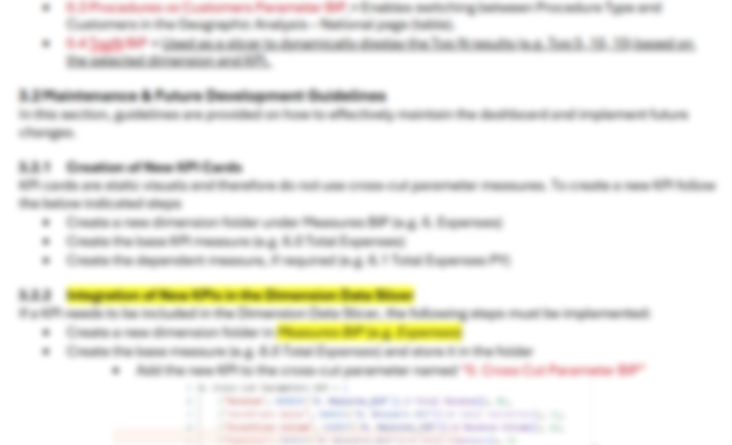
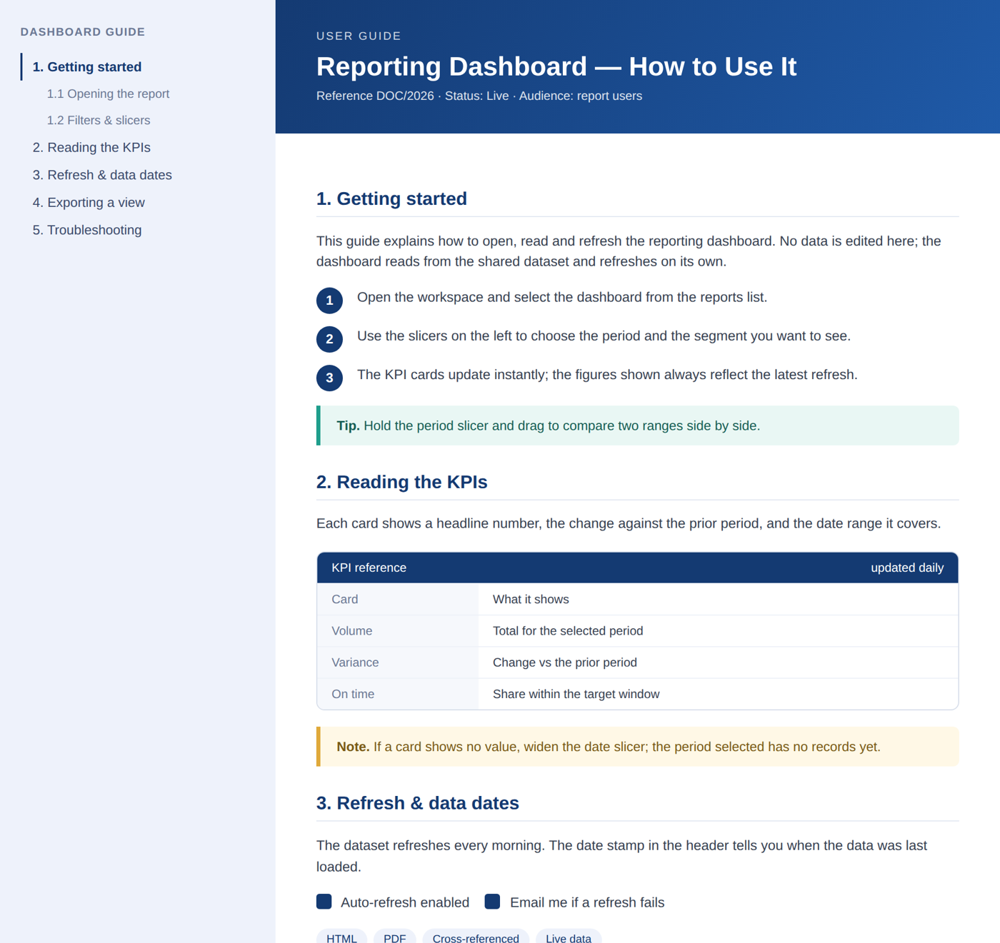
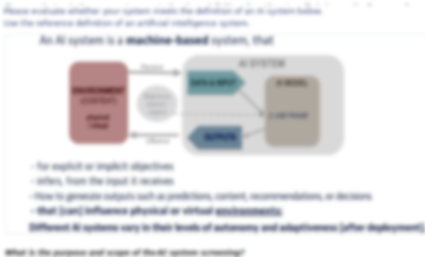
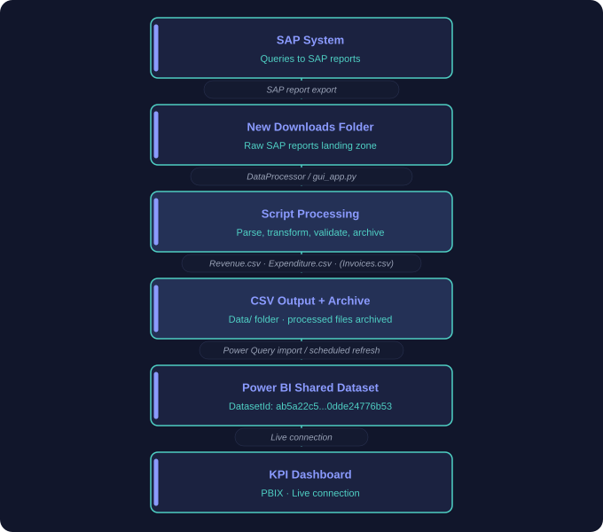
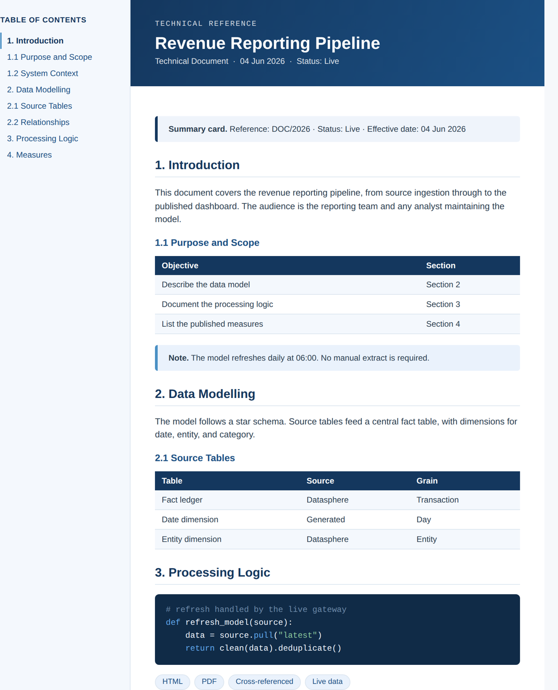

```{=html}
<span class="status-line live"><span class="dot"></span>Live</span>
```

## The problem

Team documentation lived in Word files stuffed with pasted screenshots and links that broke over time. Versions drifted apart from one team to the next, nobody tracked the changes, and every update meant fixing the same things by hand all through the document, with fonts that did not match, logos that were too big, and highlights in every colour.

```{=html}
<div class="ba-pair">
  <figure class="before"><span class="ba-tag">Before</span><figcaption>Before · yes, there really was documentation like this, with several versions, notes scribbled down the right margin, and a name like <mark>v6_Final2</mark></figcaption></figure>
  <figure class="after"><span class="ba-tag">After</span><figcaption>After · one rendered, templated document, here a dashboard user guide</figcaption></figure>
</div>
```

## What I built

```{=html}
<div class="featured-new">
  <div class="fn-label"><span class="spark">&#9733;</span>One template, every document</div>
  <h3>A documentation system built on Quarto and Markdown</h3>
  <p>Documents are written in Markdown inside a shared QMD template, with a single YAML header controlling everything: the title banner, the table of contents, syntax highlighting, and output to both HTML and PDF from the same source. One style.css carries the house colours, so every output looks identical regardless of who wrote it.</p>
</div>
```

The result is interactive rather than static: a live table of contents, collapsable callout boxes, cross references between documents, and images and graphs that update with the underlying data instead of being pasted in. Links stay alive because they are part of the build, not copied by hand.

## From data to a referenced graph

The other half of the system is how graphs get made. Instead of pasting a screenshot that goes stale, a chart is produced by a small data script and rendered into the document at build time. The same output can then be referenced and previewed from any other document, so one corrected number updates everywhere it appears.

```{=html}
<div class="ba-pair">
  <figure class="before"><span class="ba-tag">Before</span><figcaption>Before · a chart pasted in by hand, frozen the moment it was copied</figcaption></figure>
  <figure class="after"><span class="ba-tag">After</span><figcaption>After · a scripted pipeline from source data to a rendered, reusable graph</figcaption></figure>
</div>
```

The flow is end to end: source queries land in a downloads folder, a processor turns them into clean tables, those feed a shared dataset, and the chart is rendered straight into the page. Because the graph is generated rather than pasted, it carries the same styling everywhere and can be previewed and reused across documents without a single manual export.

## Why it matters

This is the quiet backbone of everything else here. Every tool I ship comes documented in this format, so it survives me being on holiday. The same YAML produces a clean web page for quick reference and a PDF for formal sign-off, from one file, with no reformatting.

```{=html}
<div class="ba-pair">
  <figure class="before"><span class="ba-tag">Before</span><figcaption>Before · another page from the old documentation, with its own formatting drift</figcaption></figure>
  <figure class="after"><span class="ba-tag">After</span><figcaption>After · another page from the same system, rendered with TOC, callouts and styled code</figcaption></figure>
</div>
```

## Outcome

Interconnected, linkable documents that can be reproduced in the same format every time. Managers get consistent reporting; the team gets documentation that is actually current. Video guides complement the written docs for onboarding.

## Before and after

```{=html}
<div class="reveal-compare" role="button" tabindex="0" aria-label="Before and after. Drag across, or press Enter, to switch between them.">
  <div class="rc-layer rc-after"><div class="rc-content"><h4>After</h4><p>One QMD template and one stylesheet rendering to interconnected HTML and PDF, with a live table of contents and cross references that never rot.</p><p class="touch">My touch: one YAML header produces both the web page and the formal PDF, so there is never a second copy to keep in sync.</p></div></div>
  <div class="rc-layer rc-before"><div class="rc-cells"></div><div class="rc-content"><h4>Before</h4><p>Word documents stuffed with pasted screenshots and links that broke over time, with versions quietly drifting apart from one team to the next.</p></div></div>
  <span class="rc-prompt"><span class="dot"></span></span>
</div>
```

```{=html}
<p class="stack-line"><strong>Stack:</strong> Quarto (QMD, Markdown), YAML, HTML, CSS, PDF output, video editing for guides</p>
```
