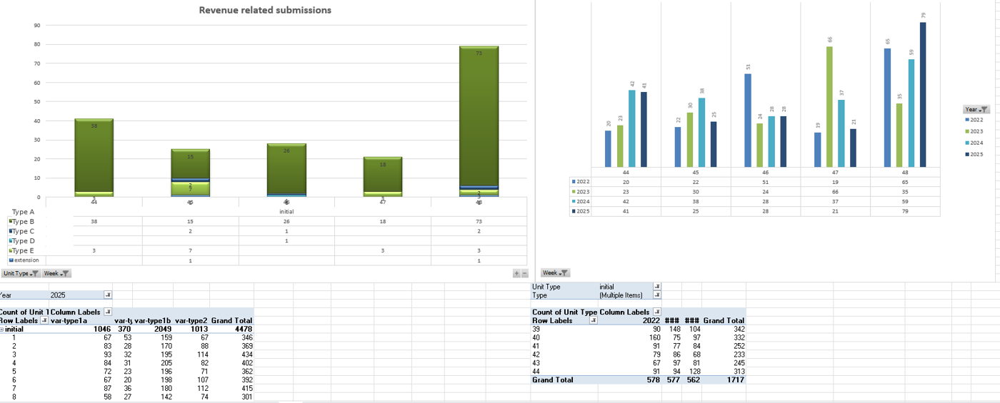
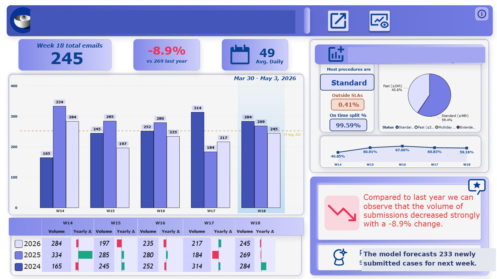
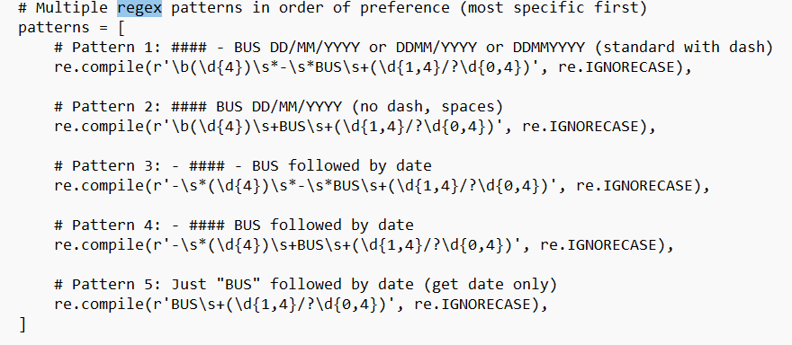
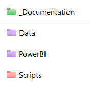
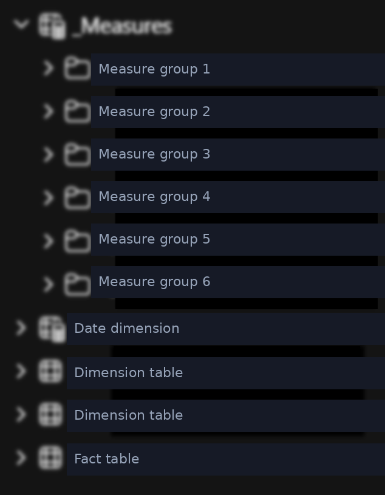
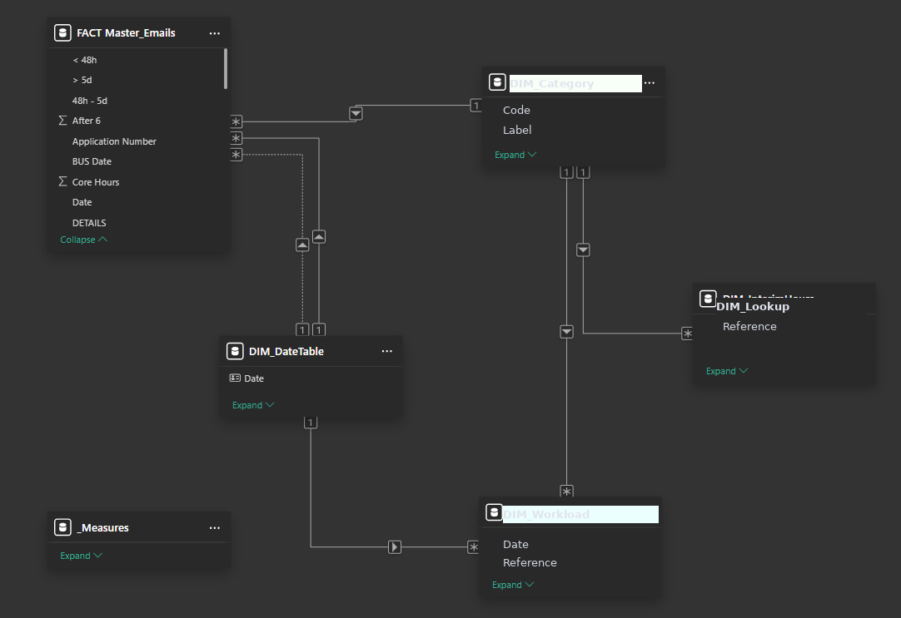
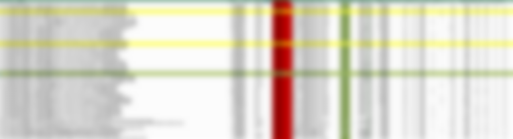
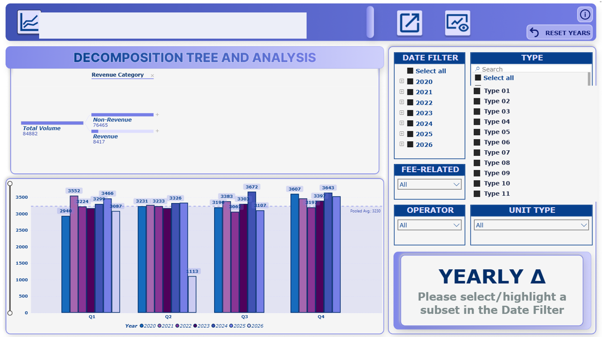

```{=html}
<span class="status-line live"><span class="dot"></span>Live</span>
```

## The problem

Weekly submission statistics depended on a VBA macro built in 2014 that downloaded one email per second, ran once a week, and locked the computer while it worked. Parsing email titles into fields produced wrong and missing values, so every run was followed by manual edits. The volume: around 500 submissions per week, on top of an archive of roughly 120,000 emails.

```{=html}
<div class="ba-pair">
  <figure class="before"><span class="ba-tag">Before</span><figcaption>Before · the weekly statistics in a fragile Excel file</figcaption></figure>
  <figure class="after"><span class="ba-tag">After</span><figcaption>After · the live submission dashboard</figcaption></figure>
</div>
```

## The new script

```{=html}
<div class="featured-new">
  <div class="fn-label"><span class="spark">&#9733;</span>The core of the rebuild</div>
  <h3>A Python tool that does in 30 seconds what used to take an hour</h3>
  <p>A small application with a GUI: pick the Outlook folder, pick the mode, run. It finds the right emails, puts every date into the same format, and runs 57 regex patterns to pull clean fields out of titles that are never written the same way twice. The patterns run from the most specific to the most general, so the messy cases get caught first.</p>
</div>
```

Here is the heart of the parser, the ordered pattern list that replaced years of manual correction:

```{=html}
<div class="shots">
  <figure><figcaption>Part of the 57-pattern parser, ordered most specific first</figcaption></figure>
  <figure><figcaption>The GUI: pick a folder, pick a mode, run</figcaption></figure>
</div>
```

The script can run automatically on computer start or manually for double checks, so the data is daily by default instead of weekly by ritual. It writes a clean CSV rather than Excel, which handles the 120,000-email archive without strain.

## Behind the scenes

A look at how the parser actually works. These snippets are simplified and anonymised, but the logic is the real thing.

```{=html}
<div class="code-tour">
  <div class="ct-head"><span class="ct-dots"><i></i><i></i><i></i></span><span class="ct-file">email_master_downloader.py</span></div>
  <div class="ct-tabs">
    <button class="ct-tab on">Ordered patterns</button>
    <button class="ct-tab">Date normalisation</button>
    <button class="ct-tab">Deduplication</button>
  </div>
  <div class="ct-body">
    <div class="ct-panel on">
      <pre><span class="cm"># Patterns run most specific first, so the messy</span>
<span class="cm"># real titles are caught before the generic ones.</span>
patterns = [
    re.compile(r<span class="st">'(\d{4})\s*-\s*REF\s+(\d{1,4}/?\d{0,4})'</span>, re.I),
    re.compile(r<span class="st">'(\d{4})\s+REF\s+(\d{1,4}/?\d{0,4})'</span>, re.I),
    re.compile(r<span class="st">'-\s*(\d{4})\s*-\s*REF\s+(\d{1,4})'</span>, re.I),
    re.compile(r<span class="st">'REF\s+(\d{1,4}/?\d{0,4})'</span>, re.I),
]
<span class="kw">for</span> rx <span class="kw">in</span> patterns:
    m = rx.search(title)
    <span class="kw">if</span> m:
        <span class="kw">return</span> normalise(m.groups())</pre>
      <div class="ct-note"><h5>Why ordered</h5>People never write a subject line the same way twice. Sorting the patterns from most to least specific means a clean match wins before a loose one can grab the wrong fragment. Fifty-seven patterns cover the long tail without a single manual correction.</div>
    </div>
    <div class="ct-panel">
      <pre><span class="cm"># Every date format people use, into one.</span>
<span class="kw">def</span> <span class="fn">normalise_date</span>(raw):
    <span class="kw">for</span> fmt <span class="kw">in</span> (<span class="st">"%d/%m/%Y"</span>, <span class="st">"%d-%m-%Y"</span>,
                <span class="st">"%d %b %Y"</span>, <span class="st">"%d.%m.%y"</span>):
        <span class="kw">try</span>:
            <span class="kw">return</span> datetime.strptime(raw, fmt)
        <span class="kw">except</span> ValueError:
            <span class="kw">continue</span>
    <span class="kw">return</span> <span class="fn">flag_for_review</span>(raw)</pre>
      <div class="ct-note"><h5>No silent failures</h5>A date that matches nothing is not dropped or guessed. It is flagged and surfaced in the dashboard, so the few genuine edge cases get a human glance instead of quietly corrupting a weekly total.</div>
    </div>
    <div class="ct-panel">
      <pre><span class="cm"># Append only what is genuinely new.</span>
key = [<span class="st">"ref"</span>, <span class="st">"date"</span>, <span class="st">"type"</span>]
merged = pd.concat([master, incoming])
merged = merged.drop_duplicates(
    subset=key, keep=<span class="st">"last"</span>)
added = len(merged) - len(master)
<span class="fn">log</span>(f<span class="st">"appended {added} new rows"</span>)</pre>
      <div class="ct-note"><h5>Idempotent runs</h5>Run it once or ten times, the archive stays correct. Deduplication on a composite key means a re-run never doubles a week, which is what made it safe to schedule on startup.</div>
    </div>
  </div>
</div>
```

## The Power BI rebuild

The clean CSV feeds a rebuilt Power BI model, not a pile of pivot tables. The new structure uses organised folders and subfolders, dynamic measures written as DAX rather than copied cells, and a clean, deduplicated data model connected through SharePoint. It is a proper star schema: a central fact table of emails joined to dimension tables for date and category, so the dynamic graphs adapt to the latest weeks on their own.

```{=html}
<div class="shots">
  <figure><figcaption>Measures in organised folders, not scattered</figcaption></figure>
  <figure><figcaption>Named measure groups and conformed tables</figcaption></figure>
  <figure><figcaption>Star schema: fact table joined to dimensions</figcaption></figure>
</div>
```

## Outcome

<mark>Around 5 hours saved every week</mark>, plus the manual checks and corrections that no longer exist. The team now has <mark>consistent, clean data since 2019</mark> and a dashboard that is always current. All documentation lives in QMD files rendered to HTML.

```{=html}
<div class="ba-pair">
  <figure class="before"><span class="ba-tag">Before</span><figcaption>Before · data highlighted and patched by hand</figcaption></figure>
  <figure class="after"><span class="ba-tag">After</span><figcaption>After · a page from the live dashboard</figcaption></figure>
</div>
```

## Before and after

```{=html}
<div class="reveal-compare" role="button" tabindex="0" aria-label="Click to reveal the after state">
  <div class="rc-layer rc-after"><div class="rc-content"><h4>After</h4><p>A background Python tool with 57 regex patterns, a clean CSV archive of 120,000 emails, and a live dashboard that needs no manual refresh.</p><p class="touch">My touch: I built the parser around the messiest titles first instead of the clean ones, so it holds up against what people actually send.</p></div></div>
  <div class="rc-layer rc-before"><div class="rc-cells"></div><div class="rc-content"><h4>Before</h4><p>An old VBA macro from 2014 that crawled through Outlook at one email per second, ran once a week, froze the machine, and got half the fields wrong.</p></div></div>
  <span class="rc-prompt"><span class="dot"></span></span>
</div>
```

```{=html}
<p class="stack-line"><strong>Stack:</strong> Python (GUI, 57 regex patterns), CSV, SharePoint, Power BI semantic model, DAX, Quarto documentation</p>
```
