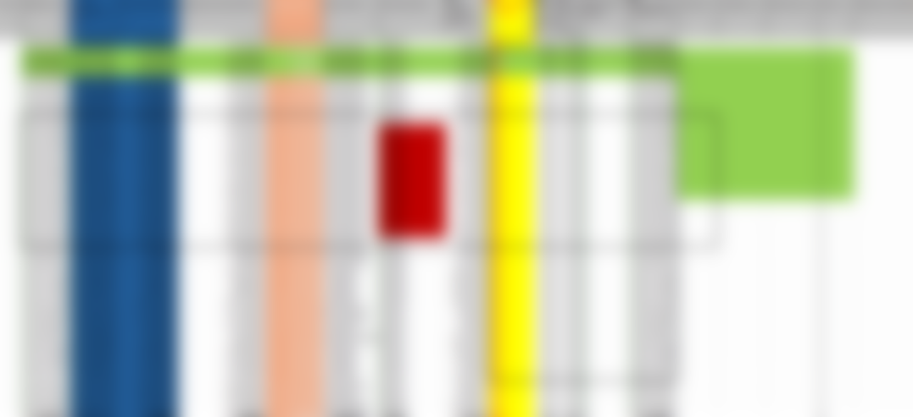
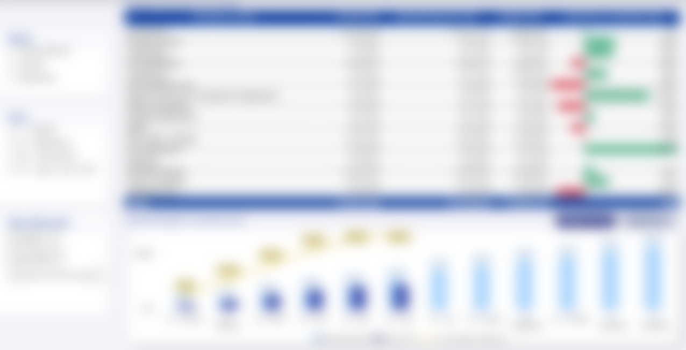
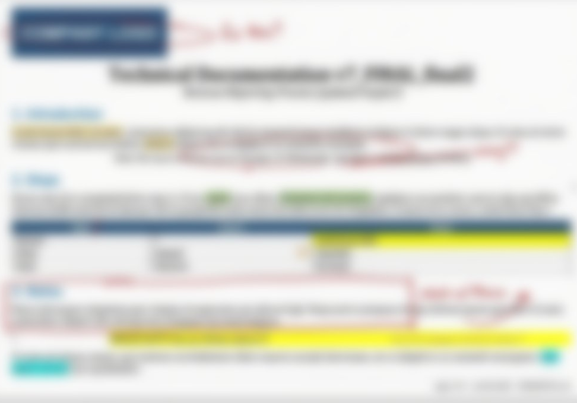
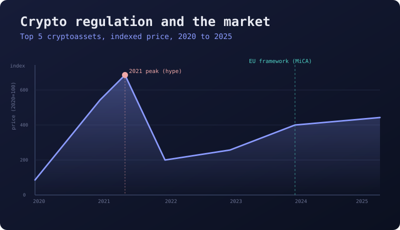

These are the six projects I have finished and am happy to put my name to. Most of them started
as somebody's Monday morning job, and I enjoyed every one of them: working out what the report was
really for, sitting with the people who had to use it, and getting to the point where the thing runs
without anybody thinking about it. Each write-up follows the same shape, the problem as it actually
was, what I built, and what changed afterwards, with numbers where I have them and the parts that
did not work where they are worth reading about.

The screenshots are all sanitised, so some of them are blurrier than I would like. Names, logos,
file paths and anything identifying comes out before a single one goes online.

```{=html}
<div class="grid">
  <a class="card" href="sap-dashboard.html">
    <div class="shot">
      <span class="lay b"></span>
      <span class="lay a"></span>
      <span class="edge"></span><span class="tag"></span>
    </div>
    <div class="body">
      <h3>Revenue &amp; expenditure pipeline</h3>
      <p>More than twenty reports pulled out of SAP by hand, each filtered inside somebody's own
        workbook. One governed model now, refreshed overnight.</p>
      <span class="tech"><i>SAP Datasphere</i><i>SQL</i><i>Power BI</i><i>Python</i></span>
      <span class="chip">20 reports → 1 model</span>
    </div>
  </a>

  <a class="card" href="email-pipeline.html">
    <div class="shot">
      <span class="lay b"></span>
      <span class="lay a"></span>
      <span class="edge"></span><span class="tag"></span>
    </div>
    <div class="body">
      <h3>Submission inbox</h3>
      <p>A VBA macro somebody wrote in 2014 and then left. It handled 500 submissions a week,
        mostly, and when one went missing we found out a month later.</p>
      <span class="tech"><i>Python</i><i>regex</i><i>Outlook</i><i>Power BI</i></span>
      <span class="chip">2014 macro → something readable</span>
    </div>
  </a>

  <a class="card" href="invoice-checker.html">
    <div class="shot">
      <span class="lay b"></span>
      <span class="lay a"></span>
      <span class="edge"></span><span class="tag"></span>
    </div>
    <div class="body">
      <h3>Invoice reconciliation</h3>
      <p>Five extracts matched by eye once a month. It took most of a day and still missed things,
        which is what happens when you ask a person to be a computer.</p>
      <span class="tech"><i>Python</i><i>automation</i><i>Excel</i></span>
      <span class="chip">5 extracts → 1 click</span>
    </div>
  </a>

  <a class="card" href="docs-system.html">
    <div class="shot">
      <span class="lay b"></span>
      <span class="lay a"></span>
      <span class="edge"></span><span class="tag"></span>
    </div>
    <div class="body">
      <h3>Documentation that stays true</h3>
      <p>Word files with broken links and nobody's name on them. If a thing only runs while I am
        around, I have not built a solution, I have built a hostage situation.</p>
      <span class="tech"><i>Quarto</i><i>Markdown</i><i>HTML</i><i>CSS</i></span>
      <span class="chip">stale docs → rendered from source</span>
    </div>
  </a>

  <a class="card" href="crypto-regulation.html">
    <div class="shot">
      <span class="lay b"></span>
      <span class="lay a"></span>
      <span class="edge"></span><span class="tag"></span>
    </div>
    <div class="body">
      <h3>Did crypto regulation move the market?</h3>
      <p>A Fama and French model with a regulation dummy, run across the top five cryptoassets.
        The EU answer and the US answer turned out to be very different.</p>
      <span class="tech"><i>econometrics</i><i>Eikon</i><i>Datastream</i><i>Fama-French</i></span>
      <span class="chip">my thesis, in one chart</span>
    </div>
  </a>

  <a class="card" href="cinema-model.html">
    <div class="shot">
      <span class="lay b"></span>
      <span class="lay a"></span>
      <span class="edge"></span><span class="tag"></span>
    </div>
    <div class="body">
      <h3>From scanned paper to a valuation</h3>
      <p>Somebody handed me a stack of scanned statements and asked what the business was worth.
        I built the whole model from the paper up.</p>
      <span class="tech"><i>financial analysis</i><i>valuation</i><i>DCF</i><i>Excel</i></span>
      <span class="chip">paper → a case for funding</span>
    </div>
  </a>
</div>

<div class="progress-card">
  <span class="badge-status dev">In progress</span>
  <div>
    <strong>A small fleet of agents.</strong>
    <p>Tools I am building to handle the tracking and triage I currently do by hand: prices and
      statuses, drafting and sorting email, and rebuilding small utilities faster than I would write
      them myself. It gets written up here once the pieces run together reliably, and not before.</p>
  </div>
</div>
```
