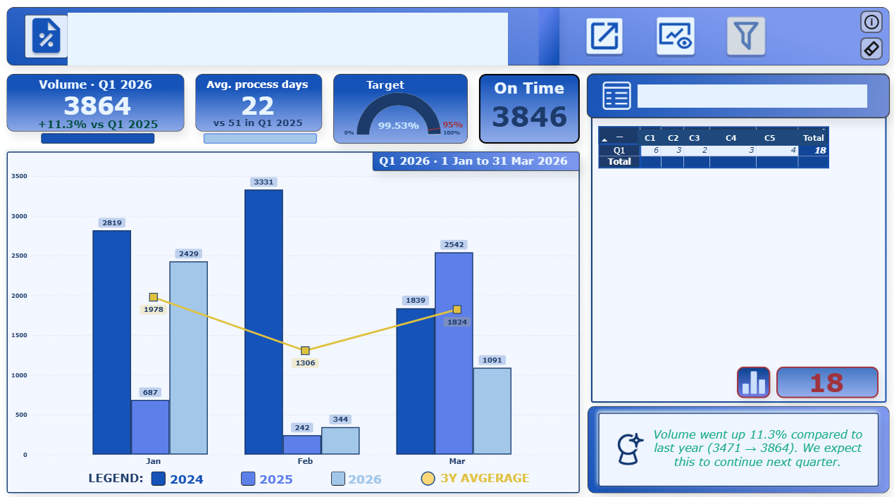
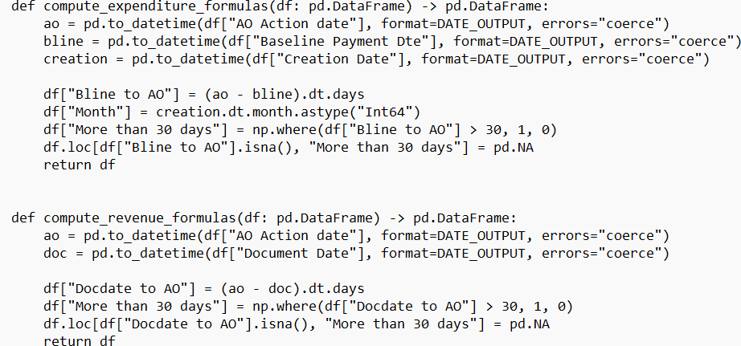
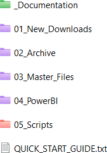
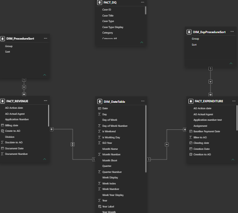

```{=html}
<span class="status-line live"><span class="dot"></span>Live and active</span>
```

## The problem

Checking supplier invoices meant combining 5 separate SAP extracts against a reference table in a static shared database, where each person uploaded and downloaded the latest version. Across several teams this turned into chaos: constant reminders, emails back and forth, and no certainty about which file was current. Each cycle covered more than 200 invoices and disputes, some open for years, across many procedure types.

```{=html}
<div class="ba-pair">
  <figure class="before"><span class="ba-tag">Before</span><figcaption>Before · five extracts merged into a shared static file</figcaption></figure>
  <figure class="after"><span class="ba-tag">After</span><figcaption>After · one validated master file</figcaption></figure>
</div>
```

## The new script

```{=html}
<div class="featured-new">
  <div class="fn-label"><span class="spark">&#9733;</span>The tool that ended the email chains</div>
  <h3>Drop five files in a folder, run, get one source of truth</h3>
  <p>A fully automated script packaged as a standalone EXE, so the team runs it without installing Python. It validates the file formats, extracts the data, applies all matching, transformation, checking and deduplication rules, archives the input files with timestamps, writes a run log, and produces a master CSV holding the full archive. On top of that sits an Excel view where each check is marked in its own colour, with a summary table built in, because the people reading it live in Excel.</p>
</div>
```

```{=html}
<div class="shots">
  <figure><figcaption>The standalone EXE: no Python needed</figcaption></figure>
  <figure><figcaption>Part of the matching and deduplication logic</figcaption></figure>
  <figure><figcaption>The folder you simply drop the files into</figcaption></figure>
</div>
```

## The data model

Behind the Excel view sits a clean, deduplicated model: a fact table of invoices and disputes joined to dimension tables for supplier, procedure type and status. The same structured approach that makes the dashboards trustworthy.

```{=html}
<div class="shots single">
  <figure><figcaption>Fact table joined to supplier, procedure and status dimensions</figcaption></figure>
</div>
```

## Outcome

One file everyone can trust, where there used to be five files and an argument. <mark>Around 10 hours of weekly work saved</mark>, plus the removal of manual checks that regularly produced wrong results. The script processes all extracts simultaneously and writes thousands of rows to the master file in seconds.

```{=html}
<div class="ba-pair">
  <figure class="before"><span class="ba-tag">Before</span><figcaption>Before · the manual reconciliation it replaced</figcaption></figure>
  <figure class="after"><span class="ba-tag">After</span><figcaption>After · the summary it builds on its own, with a colour for each status</figcaption></figure>
</div>
```

## Before and after

```{=html}
<div class="reveal-compare" role="button" tabindex="0" aria-label="Before and after. Drag across, or press Enter, to switch between them.">
  <div class="rc-layer rc-after"><div class="rc-content"><h4>After</h4><p>Drop the files in a folder, run the EXE, get one checked master file where each status has its own colour, with a full log of the run.</p><p class="touch">My touch: I shipped it as an EXE so nobody had to install Python. Adoption was instant because the tool asked nothing of the people using it.</p></div></div>
  <div class="rc-layer rc-before"><div class="rc-cells"></div><div class="rc-content"><h4>Before</h4><p>Five SAP extracts merged by hand against a shared static file, passed around by email, with no certainty which version was current.</p></div></div>
  <span class="rc-prompt"><span class="dot"></span></span>
</div>
```

```{=html}
<p class="stack-line"><strong>Stack:</strong> Python (packaged EXE), data matching and deduplication, CSV master file, Excel reporting layer</p>
```
