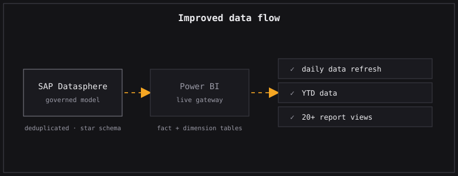
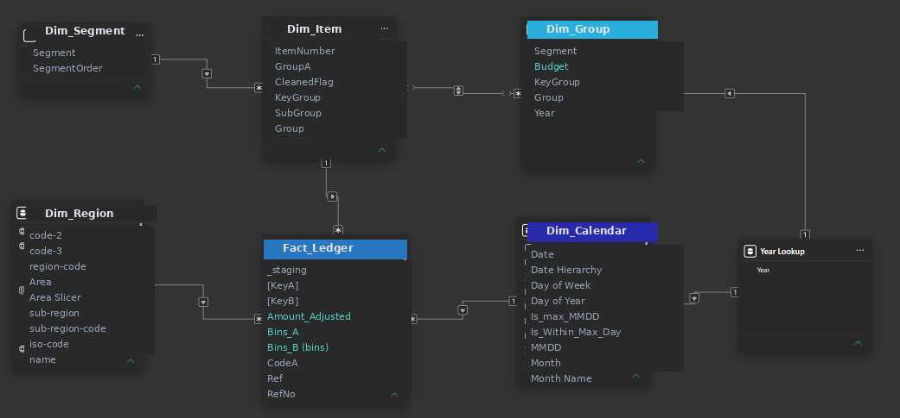
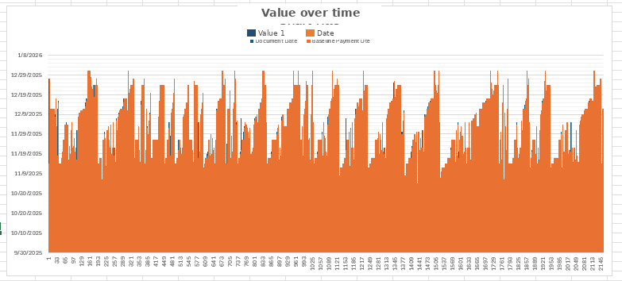
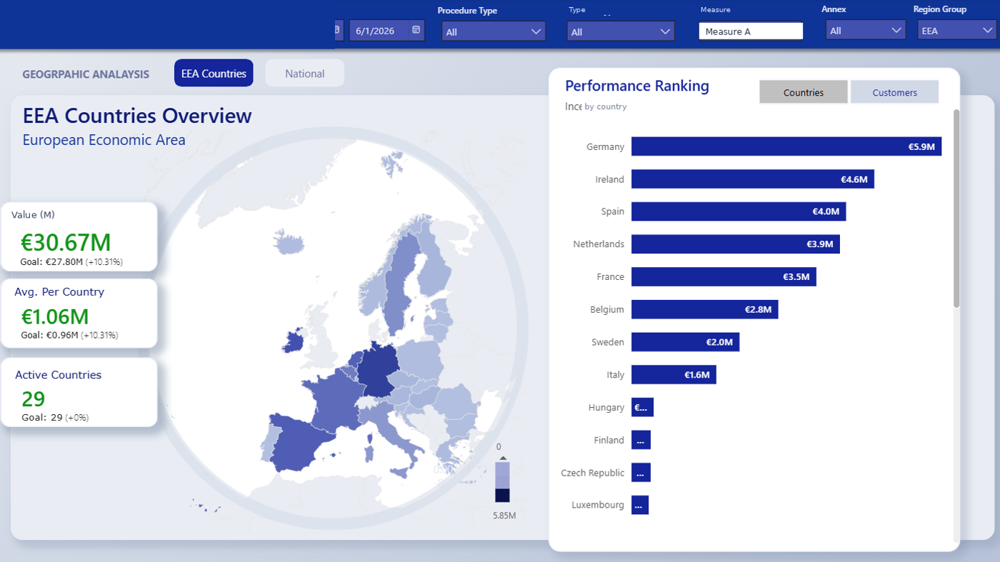

```{=html}
<span class="status-line live"><span class="dot"></span>Live and working</span>
```

## The problem

Revenue and expenditure reporting depended on more than 20 separate reports, each one pulled out of SAP by hand as an Excel file. Every workbook had its own filters applied inside it, and there was no way to trace them afterwards. The data was structured differently from one team to the next, so Finance, Procurement and the others kept producing numbers that did not agree with each other.

```{=html}
<div class="ba-pair">
  <figure class="before"><span class="ba-tag">Before</span><figcaption>Before · one of the many exports people filtered by hand</figcaption></figure>
  <figure class="after"><span class="ba-tag">After</span><figcaption>After · the live governed dashboard</figcaption></figure>
</div>
```

## What I built

I helped rewrite most of the data ingestion around one idea: a live connection instead of file exports. Working with SAP consultants, we moved the source layer to SAP Datasphere and rebuilt the data model there, so every filter and field is defined once rather than inside someone's workbook. A live gateway then feeds Power BI directly.

```{=html}

```

The new model is a clean star schema: a small set of fact tables for revenue, expenditure and commitments, connected to shared dimension tables for date, entity, fund and category. The measures live in tidy folders instead of being scattered across reports, and the data is cleaned of duplicates right at the source. The result is data up to the current date, refreshed every day, with more than 20 report views rebuilt on the same foundation.

## The data model

This is a close recreation of the rebuilt model, using mockup names. Fact tables sit at the centre, connected to conformed dimension tables, the structure that replaced more than twenty disconnected extracts.

```{=html}
<div class="shots single">
  <figure><figcaption>Star schema (recreation with mockup names): fact tables connected to shared dimensions</figcaption></figure>
</div>
```

## Outcome

The data went from being refreshed monthly or quarterly, on a different schedule for each team, to being refreshed every day across the whole organisation. The change saved <mark>around 40 collective working hours per week</mark> across the teams involved in reporting, and resolved <mark>more than 300 inconsistencies</mark> between reporting mechanisms and incorrect values.

```{=html}
<div class="ba-pair">
  <figure class="before"><span class="ba-tag">Before</span><figcaption>Before · the kind of manual report it replaced</figcaption></figure>
  <figure class="after"><span class="ba-tag">After</span><figcaption>After · one of the rebuilt report views</figcaption></figure>
</div>
```

## Before and after

```{=html}
<div class="reveal-compare" role="button" tabindex="0" aria-label="Click to reveal the after state">
  <div class="rc-layer rc-after"><div class="rc-content"><h4>After</h4><p>One governed model in SAP Datasphere feeding Power BI live. Same definitions for every team, refreshed daily, traceable end to end.</p><p class="touch">My touch: the real win was getting Finance and Procurement to agree on one definition of every field before a single line of the model was written.</p></div></div>
  <div class="rc-layer rc-before"><div class="rc-cells"></div><div class="rc-content"><h4>Before</h4><p>More than 20 reports, all pulled from SAP by hand every cycle, each one filtered inside its own workbook, and none of them agreeing with the next.</p></div></div>
  <span class="rc-prompt"><span class="dot"></span></span>
</div>
```

```{=html}
<p class="stack-line"><strong>Stack:</strong> SAP Datasphere, SQL, Power BI (live gateway), Python, Databricks</p>
```
